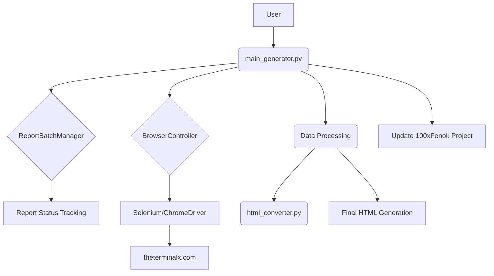

# `100xFenok-generator` 완벽 분석 보고서

## 1. 프로젝트 개요

본 프로젝트는 `theterminalx.com` 웹사이트에 접속하여, 특정 데이터를 기반으로 "100x Daily Wrap" 리포트를 자동으로 생성, 가공하고, 최종적으로 다른 프로젝트(`100xFenok`)의 결과물을 업데이트하는 것을 목표로 하는 복합 자동화 시스템이다. Selenium을 이용한 웹 UI 자동화, 데이터 추출, 외부 스크립트를 연동한 데이터 변환 등 다단계의 파이프라인으로 구성되어 있다.

## 2. 시스템 아키텍처

분석 결과, 프로젝트의 구조는 다음과 같이 여러 컴포넌트의 조합으로 이루어져 있다.

- **메인 컨트롤러 (`main_generator.py`):** 전체 자동화 흐름을 총괄한다. 로그인, 리포트 생성 요청, 상태 모니터링, 데이터 처리, 최종 결과물 업데이트 등 모든 단계를 조율한다.
- **브라우저 제어 (`browser_controller.py`):** Selenium WebDriver의 설정, 실행, 종료 등 브라우저와 관련된 저수준(low-level) 상호작용을 담당한다.
- **리포트 관리 (`report_manager.py`):** 생성 요청된 여러 리포트의 상태(대기, 생성 중, 성공, 실패)를 추적하고, 재시도 로직을 관리하는 배치(batch) 관리자 역할을 수행한다.
- **리포트 생성기 (`*_generator.py`):** `real`, `smart`, `perfect` 등 다양한 유형의 리포트 생성 로직을 담고 있는 것으로 보이나, 현재 코드상에서는 `main_generator.py`가 모든 유형을 직접 처리하고 있어 이들의 구체적인 역할은 불분명하다.
- **외부 연동 (`html_converter.py`):** 생성된 HTML 리포트를 JSON으로 변환하기 위해 `Python_Lexi_Convert`라는 별도의 프로젝트를 호출한다.

## 3. 상세 분석

### 3.1. 로그 분석 (`browser_controller_*.log`, `real_terminalx_*.log`)
- **주요 오류:** 로그 파일에서 가장 빈번하게 관찰되는 오류는 **로그인 실패**와 **리포트 폼(form) 페이지 접근 실패**이다.
  - `TimeoutException: Subscriptions 버튼을 찾을 수 없습니다.` 라는 로그는 로그인 성공 여부를 판단하는 기준 요소가 나타나지 않았음을 의미한다.
  - `[REDIRECT DETECTED] 아카이브 페이지로 리다이렉션됨` 로그는 `main_generator.py`의 복잡한 우회 로직이 실행되었음을 나타내며, 이는 웹사이트의 네비게이션이 매우 불안정함을 증명한다.
- **실행 이력:** 최근 로그(`20250823`)에서도 브라우저 컨트롤러가 실행된 기록이 있는 것으로 보아, 최근까지도 자동화 실행 시도가 있었음을 알 수 있다.

### 3.2. 주요 컴포넌트 분석
- **`main_generator.py`**: 기능 대부분이 이 파일 하나에 집중되어 있어 복잡도가 매우 높다. 특히 UI 상호작용, 예외 처리, 재시도 로직이 복잡하게 얽혀있어 유지보수가 어렵다.
- **`report_manager.py`**: 리포트 상태를 관리하는 클래스는 잘 설계되어 있으나, 재시도 로직이 `main_generator.py`에도 분산되어 있어 역할 분리가 불완전하다.
- **`DEBUG_GUIDE.md`**: 해당 파일은 존재하지만, 현재 코드에서 발견되는 복잡한 리다이렉션 문제나 로그인 실패 시의 구체적인 디버깅 가이드는 부족한 상태이다.

## 4. 핵심 문제 재정의

이전 분석을 종합하고 심화하여, 프로젝트의 근본적인 장애물을 아래와 같이 재정의한다.

1.  **치명적인 UI 종속성 및 불안정성**: 프로젝트의 성패가 전적으로 `theterminalx.com`의 현 UI 상태에 달려있다. 로그인 절차와 페이지 이동 로직이 너무 특정적이고 깨지기 쉬워, 사소한 UI 변경에도 전체 시스템이 멈춘다. **이것이 가장 시급하고 핵심적인 문제이다.**
2.  **미완성된 데이터 파이프라인**: 설령 UI 자동화가 100% 성공하더라도, `integrate_json_data`와 `build_final_html` 함수가 구현되지 않아 최종 결과물을 생성할 수 없다.
3.  **취약한 실행 환경**: 로컬에 하드코딩된 `chromedriver.exe` 경로, 다른 프로젝트(`Python_Lexi_Convert`, `100xFenok`) 파일에 대한 직접적인 상대 경로 참조 등은 다른 환경에서의 실행을 거의 불가능하게 만든다.

## 5. 종합 해결 전략

아래 3단계의 구체적인 실행 계획을 통해 프로젝트의 안정성을 확보하고 기능을 완성할 수 있다.

### Phase 1: 환경 안정화 및 표준화 (즉시 실행 가능)
- **목표**: 어떤 개발 환경에서도 일관되게 실행될 수 있는 기반을 마련한다.
- **세부 계획**:
  1.  **ChromeDriver 자동화**: `install_dependencies.bat`을 수정하거나 `requirements.txt`에 `webdriver-manager` 또는 유사 라이브러리를 추가하여, 로컬에 설치된 크롬 버전에 맞는 드라이버를 자동으로 다운로드하고 사용하도록 변경한다.
  2.  **경로 문제 해결**: 모든 파일 및 디렉터리 경로를 `os.path` 또는 `pathlib`을 사용하여 스크립트의 실행 위치를 기준으로 동적으로 계산하도록 코드를 전면 수정한다.

### Phase 2: UI 자동화 리팩토링 및 안정화
- **목표**: 실패율이 높은 웹 자동화 로직을 안정화하고, 주요 기능을 모듈화하여 재사용성을 높인다.
- **세부 계획**:
  1.  **`BrowserController` 역할 강화**: 로그인, 특정 페이지 이동, 폼 제출 등 웹사이트의 주요 동작을 `browser_controller.py` 내의 독립된 함수(예: `login()`, `navigate_to_form(form_id)`)로 분리한다.
  2.  **안정적인 대기 로직 적용**: `main_generator.py` 내 모든 `time.sleep()` 호출을 `WebDriverWait`을 사용한 명시적 대기로 전환하여 안정성을 극대화한다.
  3.  **리다이렉션 문제 해결**: 현재의 복잡한 우회 로직 대신, 로그인 후 쿠키(cookie)를 저장하고, 이후 요청에 쿠키를 사용하여 인증을 통과하는 API 기반 접근 또는 더 안정적인 UI 접근 방식을 연구하고 적용한다.

### Phase 3: 데이터 파이프라인 구현
- **목표**: 데이터 처리 및 최종 결과물 생성 로직을 완성한다.
- **세부 계획**:
  1.  **데이터 통합 로직 구현**: `docs/Instruction_Json.md`(필요시 생성)의 규칙에 따라 `integrate_json_data` 함수를 구현한다.
  2.  **HTML 빌더 구현**: `build_final_html` 함수에 Jinja2와 같은 템플릿 엔진을 적용하여, 통합된 JSON 데이터를 바탕으로 최종 HTML 리포트를 생성하는 기능을 구현한다.

## 6. 결론

`100xFenok-generator` 프로젝트는 개념적으로 훌륭하나, 현재의 구현 방식은 실제 운영 환경에서 사용하기에 매우 불안정하다. 특히 **웹 UI에 대한 강한 종속성**이 가장 큰 문제이다. 

따라서, **Phase 1(환경 안정화)**을 즉시 시작하고, 이어서 **Phase 2(UI 자동화 안정화)**에 집중하여 프로젝트의 실패율을 낮추는 것이 급선무이다. 이 두 단계가 완료된 후에야 **Phase 3(데이터 파이프라인 구현)**가 의미를 가질 것이다.
